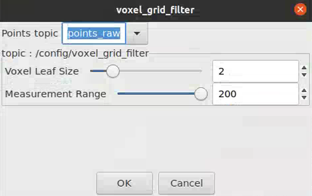
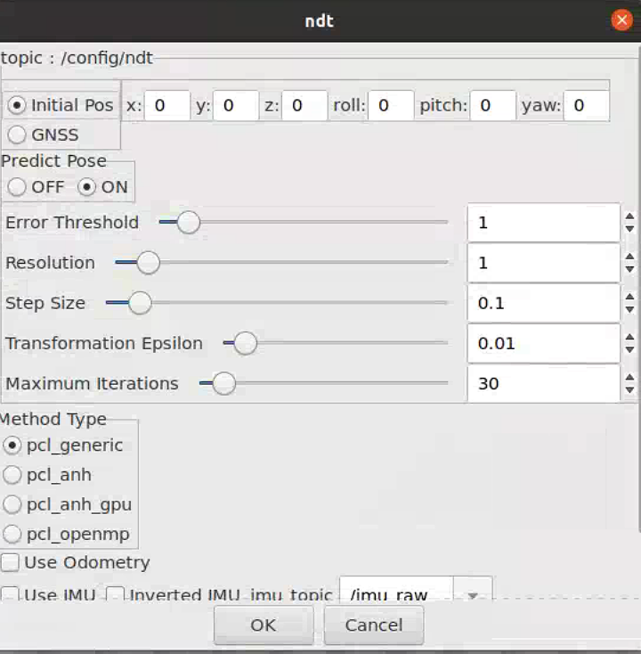
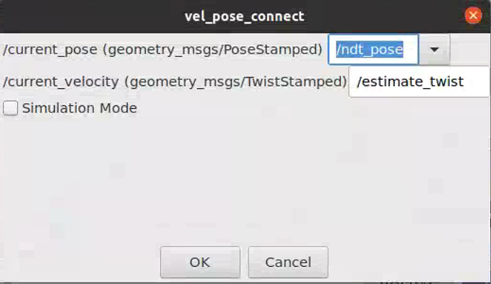
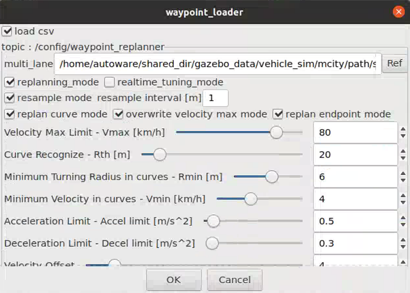

# Autoware&Gazebo simulation

## The first run

### step 1 implement base version of autoware in docker

please refer to [AutowareUserGuide](AutowareUserGuide.md) for details

```shell
# current dir: docker/generic
sudo ./run.sh -c off -t 1.14.0 -b /home/yan/YanWorkSpace/Docker_ShareDir/Autoware1.14.0_src 
```

### step 2 complie autoware from source code

please refer to [AutowareUserGuide](AutowareUserGuide.md) for details

```shell
cd Autoware
mkdir src
wget -O autoware.ai.repos "https://raw.githubusercontent.com/Autoware-AI/autoware.ai/1.14.0/autoware.ai.repos"
vcs import src < autoware.ai.repos
rosdep update
rosdep install -y --from-paths src --ignore-src --rosdistro $ROS_DISTRO
colcon build --cmake-args -DCMAKE_BUILD_TYPE=ReleaseO
```

### step 3 upgrade gazebo

- Please refer to the gazebo offical [tutorual 1](https://classic.gazebosim.org/tutorials?cat=install&tut=install_ubuntu&ver=9.0) and [tutorial 2](https://classic.gazebosim.org/tutorials?tut=ros_installing&cat=connect_ros) for details. Only small changes are made.

- Note that there is another widely used [tutorial](https://bitbucket.org/DataspeedInc/velodyne_simulator/src/56d11e899ce0a198e7206298b3aaaf8004f3a2c6/gazebo_upgrade.md?fileviewer=file-view-default) about upgrading gazebo. When I used this tutorial for gazebo upgrading, my later steps did not obtain a desired result. Therefore, be careful if you want to use this [tutorial](https://bitbucket.org/DataspeedInc/velodyne_simulator/src/56d11e899ce0a198e7206298b3aaaf8004f3a2c6/gazebo_upgrade.md?fileviewer=file-view-default).

```shell
sudo sh -c 'echo "deb http://packages.osrfoundation.org/gazebo/ubuntu-stable `lsb_release -cs` main" > /etc/apt/sources.list.d/gazebo-stable.list'

wget https://packages.osrfoundation.org/gazebo.key -O - | sudo apt-key add -

sudo apt-key adv --keyserver keyserver.ubuntu.com --recv-keys F42ED6FBAB17C654

sudo apt-get update

sudo apt-get upgrade gazebo9

sudo apt-get install ros-melodic-gazebo-ros-pkgs ros-melodic-gazebo-ros-control
```

### step 4 download gazebo models

Download gazebo models in advance can speed up gazebo.

```shell
# run gazebo and then exit manually
gazebo

# download and copy gazebo_models into .gazebo/models
sudo cp -r /home/autoware/shared_dir/gazebo_models/ /home/autoware/.gazebo/models/
```

### step 5 start autoware&gazebo simulation

[![ 4:15 / 8:33 autoware&gazebo simulation in docker : motion planning [tutorial step by step]](https://res.cloudinary.com/marcomontalbano/image/upload/v1656247334/video_to_markdown/images/youtube--2daavx76vDI-c05b58ac6eb4c4700831b2b3070cd403.jpg)](https://www.youtube.com/watch?v=2daavx76vDI&t=160s " 4:15 / 8:33 autoware&gazebo simulation in docker : motion planning [tutorial step by step]")

___

- In `Simulation` page
  
  - click `Gazebo` to launch Gazebo and wait until it is successfully loaded
  
  - click `RViz`

- In `Setup` page
  
  - click `TF, Vehicle Model` in order

- In `Map` page
  
  - set path of `Point CLoud`: /home/autoware/shared_dir/gazebo_data/vehicle_sim/autoware_world/pointcloud_map/xxx.pcd, and then click `Point CLoud`
  - set path of `TF`: /home/autoware/shared_dir/gazebo_data/vehicle_sim/autoware_world/tf/tf.launch, and then click `TF`

- In `Sensing` page
  
  - tick `voxel_grid_filter` 
    
    

- in `Computing` page
  
  - click `app` of `ndt_matching` and tick `Intial Pos`, and then tick `ndt_matching`
    
    
  
  - tick `vel_pose_connect`  
    
    
  
  - click `app`of `waypoint loader`and set the csv path as: /home/autoware/shared_dir/gazebo_data/vehicle_sim/autoware_world/path/saved_waypoints.csv
    
    
  
  - tick `waypoint_loader` and go to `rviz` to wait for the loading of gloabl waypoints
  
  - tick `lane_navi, lane_rule, lane_stop, lane_select` in order
  
  - tick `astar_void, velocity_set, pure_pursuit, twist_filter` in oder and go to rviz to see if the vehicle starts to move 

### step 5 save all changes to a new docker image

Do not exit the container. Open a new terminator and execute the following actions.

- Save the current containder to a docker image.
  
  ```shell
  docker commit <container_id> <repo>:<tag> 
  ```
  
  for example
  
  ```shell
  docker commit 5dg7 autoware/autoware:1.14.0-melodic-base-gazebo9.19` 
  ```

- exit the current container (optional)

----

The modified image is published into the local repo with name `autoware/autoware:1.14.0-melodic-base-gazebo9.19`

To launch it:

```shell
sudo ./run_base_gazebo.sh -c off -t 1.14.0 -b /home/yan/YanWorkSpace/Docker_ShareDir/Autoware1.14.0_src 
```

## Not the first run

launch the previously saved docker image

```shell
sudo ./run_base_gazebo.sh -c off -t 1.14.0 -b /home/yan/YanWorkSpace/Docker_ShareDir/Autoware1.14.0_src 
```

Then you can perform the step 5 in the last chaper.
