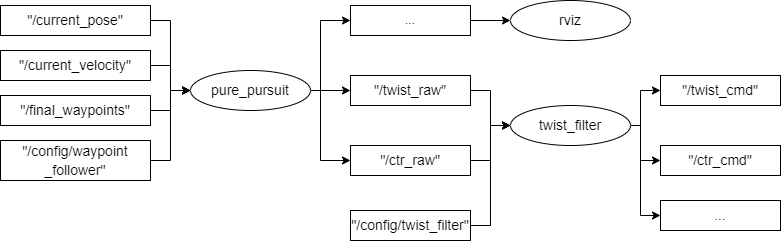

## Overview

## Pure pursuit method

### Functionality

- todo

### ROS topic and node

(1) Communication between nodes and related messages



- `pure_pursuit` node receives `"/final_waypoints"` from planning module and `"/current_velocity", "/current_pose"` from localization module

- `pure_pursuit` node finds a specific point `X`in `/final_waypoints` and applies interpolation method to obtain **the position `next_target_position` to pursuit** between `X` and `current_pose`

- `pure_pursuit` node calculates the theoretical curvature from`current_pose` to `next_target_position` and the corresponding steering angle

- `pure_pursuit` node calculates the linear speed and angular speed in the `current_pose`

- `pure_pursuit` node calculates the longitudinal acceleration and centripetal acceleration to reach the `next_target_position`

- `pure_pursuit` node publishes `"/twist_raw"` (including linear speed and angular speed and `"/ctr_raw"`(including linear speed, longitudinal acceleration and steering angle)

- `twist_filter` node receives `"/twist_raw"` and `"/ctr_raw"`, and apply lateral limits on speed and acceleration on them, finally publishing `"/twist_cmd"` and `"/ctr_cmd"`

### Source code analysis

#### node `"/pure_pursuit"`

Three main files:

- src\autoware\core_planning\pure_pursuit\src\pure_pursuit_node.cpp

- src\autoware\core_planning\pure_pursuit\src\pure_pursuit_core.cpp

- src\autoware\core_planning\pure_pursuit\src\pure_pursuit.cpp

##### (1) waypoint_follower::PurePursuitNode 的构造函数

##### (2)

#### node `"/twist_filter"`

#### node`"/twist_gate"`

`src\autoware\core_planning\twist_gate\src\twist_gate.cpp`

将`"/twist_cmd"` and `"/ctrl_cmd"`的信息进行汇总，发布`"/vehicle_cmd"` ,该消息格式如下:

```
Header header
autoware_msgs/SteerCmd steer_cmd
autoware_msgs/AccelCmd accel_cmd
autoware_msgs/BrakeCmd brake_cmd
autoware_msgs/LampCmd lamp_cmd
autoware_msgs/Gear gear_cmd
int32 mode
geometry_msgs/TwistStamped twist_cmd
autoware_msgs/ControlCommand ctrl_cmd
int32 emergency
```

## Other method

- todo

## TODO

- analyze `core_planning\twist_gate\src\twist_gate_node.cpp`
