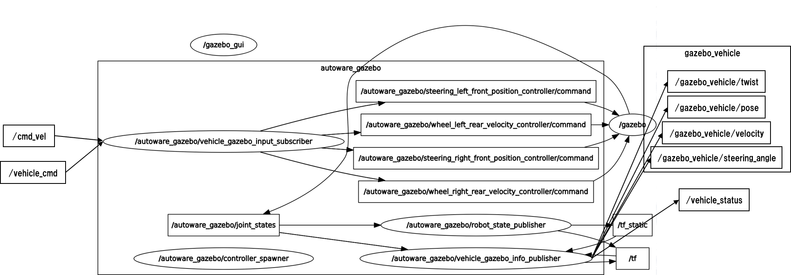

- [Takeways](#takeways)
- [Overview](#overview)
- [Source code analysis](#source-code-analysis)
  - [1. click `gazebo` in the `simulation` page of autoware runtime manager](#1-click-gazebo-in-the-simulation-page-of-autoware-runtime-manager)
  - [2. analyze `gazebo_launcher.launch`](#2-analyze-gazebo_launcherlaunch)
    - [(1) declare `world`](#1-declare-world)
    - [(2) launch the `world`](#2-launch-the-world)
      - [(3) Spawn URDF Robots](#3-spawn-urdf-robots)
    - [(4) load vehicle parameters for nodes in namespace `/vehicle_info`](#4-load-vehicle-parameters-for-nodes-in-namespace-vehicle_info)
    - [(5) launch two nodes `controller_spawner`, `robot_state_publisher` from ROS pkgs](#5-launch-two-nodes-controller_spawner-robot_state_publisher-from-ros-pkgs)
    - [(6) launch `vehicle_gazebo_input_subscriber` node](#6-launch-vehicle_gazebo_input_subscriber-node)
    - [(7) launch `vehicle_gazebo_info_publisher` node](#7-launch-vehicle_gazebo_info_publisher-node)
  - [3. analyze `vehicle_gazebo_input_subscriber.cpp`](#3-analyze-vehicle_gazebo_input_subscribercpp)
    - [(1) analyze `vehicle_gazebo_input_subscriber.cpp`](#1-analyze-vehicle_gazebo_input_subscribercpp)
    - [(2) analyze `vehicleCmdCallback()`](#2-analyze-vehiclecmdcallback)
    - [(3) analyze `publishTwistStamped2Gazebo()`](#3-analyze-publishtwiststamped2gazebo)
  - [4. analyze `vehicle_gazebo_info_publisher.cpp`](#4-analyze-vehicle_gazebo_info_publishercpp)
    - [(1) analyze `vehicle_gazebo_info_publisher.cpp`](#1-analyze-vehicle_gazebo_info_publishercpp)
    - [(2) analyze `jointStateCallback()`](#2-analyze-jointstatecallback)
  - [5. ros nodes and messages](#5-ros-nodes-and-messages)
- [Use gazebo in autoware](#use-gazebo-in-autoware)
  - [1. simple operating tutorial](#1-simple-operating-tutorial)
- [Gazebo provides the ground truth of vehicle pose](#gazebo-provides-the-ground-truth-of-vehicle-pose)
  - [1. `"/gazebo_vehicle/pose"`](#1-gazebo_vehiclepose)

### Takeways

- the msgs `"/gazebo_vehicle/pose"` from gaze reflects the ground truth of vehicle pose

### Overview

- todo

### Source code analysis

#### 1. click `gazebo` in the `simulation` page of autoware runtime manager


the corresponding command behind the `gazebo` button is listed in `utilities\runtime_manager\scripts\simulation.yaml` :

```yaml
# line 24-27
gazebo :
  run : sh -c "$(rospack find runtime_manager)/scripts/gazebo.sh"
  gui :
     flags : [ kill_children ]
```

whereas `utilities\runtime_manager\scripts\gazebo.sh` is given below:

```bash
#!/bin/sh

roslaunch vehicle_gazebo_simulation_launcher gazebo_launcher.launch gpu:=true &

while :; do sleep 10; done

# EOF
```

the referred launch file is located in `simulation\vehicle_gazebo_simulation_launcher\launch\gazebo_launcher.launch`

#### 2. analyze `gazebo_launcher.launch`

##### (1) declare `world`

```xml
<launch>
    <!-- #line 7 -->
    <arg name="world_name" default="mcity"/>
    ...
    <!-- #line 17 -->
    <arg name="world_file_name" default="$(find gazebo_world_description)/worlds/mcity_r1.world" if="$(eval world_name=='mcity')" />
    ...
    <!-- #line 23 -->
    <arg name="spawn_model_flag" default="-x 3 -y -12 -z 0.5" if="$(eval world_name=='mcity')" />
</launch>
```

as shown:

| arg              | value                                                        |
| ---------------- | ------------------------------------------------------------ |
| world_name       | mcity                                                        |
| world_file_name  | visualization\gazebo_world_description\worlds\mcity_r1.world |
| spawn_model_flag | -x 3 -y -12 -z 0.5                                           |

##### (2) launch the `world`

```xml
<!-- line 27-35 -->
<!-- launch gazebo -->
<include file="$(find gazebo_ros)/launch/empty_world.launch">
  <arg name="world_name" default="$(arg world_file_name)"/> 
  <arg name="paused" value="false"/>
  <arg name="use_sim_time" value="true"/>
  <arg name="gui" value="true"/>
  <arg name="headless" value="false"/>
  <arg name="debug" value="false"/>
</include>
```

In this launch file we inherit most of the necessary functionality from empty_world.launch. The only parameter we need to change is the `world_name` parameter, substituting the `empty.world` world file with the `mcity_r1.world` file. The other arguments are simply set to their default values.

##### (3) Spawn URDF Robots

```xml
<!--line 4-->
<arg name="model" default="$(find vehicle_model)/urdf/vehicle.xacro"/>

<!--line 12 -->
<!-- Convert an xacro and put on parameter server -->
<param name="robot_description" command="$(find xacro)/xacro.py --inorder $(arg model) gpu:=$(arg gpu)" />

<!--line 37 -->
<!-- Spawn a robot into Gazebo via "ROS Service Call" Robot Spawn Method (URDF is in .XACRO format) -->
<node name="spawn_urdf" pkg="gazebo_ros" type="spawn_model" args="-param robot_description $(arg spawn_model_flag) -urdf -model autoware_gazebo" />
```

whereas `autoware_gazebo` in line 37 are defined in `visualization\vehicle_model\urdf\vehicle.xacro`:

```xml
<!--line 2-->
<robot name="autoware_gazebo" xmlns:xacro="http://ros.org/wiki/xacro">
```

The analysis of `vehicle.xacro` is listed in section 3.

##### (4) load vehicle parameters for nodes in namespace `/vehicle_info`

```xml
<!--line 39-41-->
<group ns="/vehicle_info">
  <rosparam file="$(find vehicle_model)/config/vehicle_info.yaml" command="load"/>
</group>
```

`rosparam` [command](http://wiki.ros.org/roslaunch/XML/rosparam) here load parameters from `visualization\vehicle_model\config\vehicle_info.yaml`:

```
wheel_radius: 0.341
wheel_width: 0.225
wheel_base: 2.950
wheel_tread: 1.55
vehicle_mass: 5000.0
vehicle_length: 4.82
vehicle_width: 1.81
vehicle_height: 1.5
minimum_turning_radius: 2.950
maximum_steering_angle: 97.3 #deg
```

##### (5) launch two nodes `controller_spawner`, `robot_state_publisher` from ROS pkgs

```xml
<!--line 42-50-->
<group ns="$(arg ns)">
  <!-- Load joint controller configurations from YAML file to parameter server -->
  <rosparam file="$(find vehicle_model)/config/controller.yaml" command="load"/>
  <!-- load the controllers -->
  <node name="controller_spawner" pkg="controller_manager" type="spawner" respawn="false"
        output="screen" 
        args="wheel_left_rear_velocity_controller wheel_right_rear_velocity_controller steering_left_front_position_controller steering_right_front_position_controller joint_state_controller"/>
  <!-- tf publisher -->
  <node name="robot_state_publisher" pkg="robot_state_publisher" type="robot_state_publisher" />
  ...
</group>
```

| node name             | pkg                   | reference                                 |
| --------------------- | --------------------- | ----------------------------------------- |
| controller_spawner    | controller_manager    | http://wiki.ros.org/controller_manager    |
| robot_state_publisher | robot_state_publisher | http://wiki.ros.org/robot_state_publisher |

##### (6) launch `vehicle_gazebo_input_subscriber` node

```xml
<!--line 8-9 -->
<arg name="input/twiststamped" default="true"/>
<arg name="input/ctrl_cmd" default="false"/>
...
<group ns="/vehicle_info">
  ...
  <!--line 52-57-->
  <node name="vehicle_gazebo_input_subscriber" pkg="vehicle_gazebo_simulation_interface" type="vehicle_gazebo_input_subscriber" respawn="false"
        output="screen">
    <param name="twist_sub" value="true" />
    <param name="twiststamped" value="$(arg input/twiststamped)" />
    <param name="ctrl_cmd" value="$(arg input/ctrl_cmd)" />
  </node>
  ...
</group>
```

parameters fed into `vehicle_gazebo_input_subscriber` node can be summarized below:

| param        | value |
| ------------ | ----- |
| twist_sub    | true  |
| twiststamped | true  |
| ctrl_cmd     | false |

whereas the source code of `vehicle_gazebo_input_subscriber`  is located in `simulation\vehicle_gazebo_simulation_interface\src\vehicle_gazebo_input_subscriber.cpp`

##### (7) launch `vehicle_gazebo_info_publisher` node

```xml
<!--line 10-->
<arg name="output/groud_truth_tf_pose" default="false"/>
...
<group ns="/vehicle_info">
  ...
  <!--line 58-61-->
  <node name="vehicle_gazebo_info_publisher" pkg="vehicle_gazebo_simulation_interface" type="vehicle_gazebo_info_publisher" respawn="false"
        output="screen">
    <param name="enable_base_link_tf" value="$(arg output/groud_truth_tf_pose)" />
  </node>
  ...
</group>
```

parameters fed into `vehicle_gazebo_info_publisher` node can be summarized below:

| param               | value |
| ------------------- | ----- |
| enable_base_link_tf | false |

whereas the source code of `vehicle_gazebo_info_publisher` is located in `simulation\vehicle_gazebo_simulation_interface\src\vehicle_gazebo_info_publisher.cpp` 

#### 3. analyze `vehicle.xacro`

- [urdf/Tutorials/Using Xacro to Clean Up a URDF File - ROS Wiki](http://wiki.ros.org/urdf/Tutorials/Using%20Xacro%20to%20Clean%20Up%20a%20URDF%20File)
- [xacro - ROS Wiki](http://wiki.ros.org/xacro)

##### (1) part 1: load required`.xacro` files and set some parameters

```xml
<?xml version="1.0"?>
<robot name="autoware_gazebo" xmlns:xacro="http://ros.org/wiki/xacro">
  <xacro:include filename="$(find vehicle_model)/urdf/body.xacro" />
  <xacro:include filename="$(find vehicle_model)/urdf/wheel.xacro" />
  <xacro:include filename="$(find vehicle_model)/urdf/steering.xacro" />
  <xacro:include filename="$(find velodyne_description)/urdf/HDL-32E.urdf.xacro"/>
  <xacro:include filename="$(find velodyne_description)/urdf/VLP-16.urdf.xacro"/>
  <xacro:include filename="$(find gazebo_camera_description)/urdf/monocular_camera.xacro"/>
  <xacro:include filename="$(find gazebo_imu_description)/urdf/imu.xacro"/>

  <xacro:arg name="gpu" default="false"/>

  <xacro:property name="pi" value="3.1415926835897931"/>

  <link name="base_link"/>

  <!-- ================ vehicle ================ -->
  <!-- load parameter -->
    <xacro:property name="vehicle_info" value="${load_yaml('$(find vehicle_model)/config/vehicle_info.yaml')}"/>
  <!-- set parameter -->
    <xacro:property name="wheel_radius" value="${vehicle_info['wheel_radius']}"/>
  <xacro:property name="wheel_width" value="${vehicle_info['wheel_width']}"/>
  <xacro:property name="wheel_base" value="${vehicle_info['wheel_base']}"/>
  <xacro:property name="wheel_tread" value="${vehicle_info['wheel_tread']}"/>
  <xacro:property name="vehicle_mass" value="${vehicle_info['vehicle_mass']}"/>
  <xacro:property name="vehicle_length" value="${vehicle_info['vehicle_length']}"/>
  <xacro:property name="vehicle_width" value="${vehicle_info['vehicle_width']}"/>
  <xacro:property name="vehicle_height" value="${vehicle_info['vehicle_height']}"/>
  <xacro:property name="vehicle_mass_height" value="0.5"/>

  <!-- body-->
  <xacro:body_macro suffix="base_body"
                    parent="base_link"
                    wheel_radius="${wheel_radius}"
                    wheel_base="${wheel_base}"
                    vehicle_mass="${vehicle_mass}"
                    vehicle_mass_height="${vehicle_mass_height}"
                    vehicle_length="${vehicle_length}"
                    vehicle_width="${vehicle_width}"
                    vehicle_height="${vehicle_height}"/>
  <!-- steering-->
  <xacro:steering_link_macro suffix="steering_front" parent="base_body_link" x="${wheel_base}" y="0"/>
  <xacro:steering_macro suffix="steering_right_front" parent="steering_front_link" x="0" y="${-1*wheel_tread/2}" yaw="0" length="${wheel_width}"/>
  <xacro:steering_macro suffix="steering_left_front" parent="steering_front_link" x="0" y="${wheel_tread/2}" yaw="0" length="${wheel_width}"/>
  <!-- wheel -->
  <xacro:wheel_macro suffix="wheel_right_front" parent="steering_right_front_link" x="0" y="0" yaw="${pi}" radius="${wheel_radius}" width="${wheel_width}"/>
  <xacro:wheel_macro suffix="wheel_left_front" parent="steering_left_front_link" x="0" y="0" yaw="0" radius="${wheel_radius}" width="${wheel_width}"/>
  <xacro:wheel_macro suffix="wheel_right_rear" parent="base_body_link" x="0" y="${-1*wheel_tread/2}" yaw="${pi}" radius="${wheel_radius}" width="${wheel_width}"/>
  <xacro:wheel_macro suffix="wheel_left_rear" parent="base_body_link" x="0" y="${wheel_tread/2}" yaw="0" radius="${wheel_radius}" width="${wheel_width}"/>
  <!-- actuator -->
  <xacro:include filename="$(find vehicle_model)/urdf/actuator.xacro"/>
  ...
</robot>
```

##### (2) part 2: load `vehicle.gazebo`

```xml
<!-- line 53-->
<!-- gazebo -->
<xacro:include filename="$(find vehicle_model)/urdf/vehicle.gazebo"/>
```

whereas `visualization\vehicle_model\urdf\vehicle.gazebo` :

```xml
<?xml version="1.0"?>
<robot xmlns:xacro="http://ros.org/wiki/xacro">

  <xacro:include filename="$(find vehicle_model)/urdf/wheel.gazebo"/>
  <xacro:include filename="$(find vehicle_model)/urdf/steering.gazebo"/>
  <gazebo>
    <plugin name="gazebo_ros_control" filename="libgazebo_ros_control.so">
      <robotNamespace>/autoware_gazebo</robotNamespace>
      <robotSimType>gazebo_ros_control/DefaultRobotHWSim</robotSimType>
    </plugin>
  </gazebo>
  <gazebo>
    <plugin filename="libgazebo_ros_joint_state_publisher.so" name="joint_state_publisher">
      <jointName>wheel_left_rear_joint, wheel_right_rear_joint, steering_left_front_joint, steering_right_front_joint, wheel_left_front_joint, wheel_right_front_joint</jointName>
      <updateRate>10.0</updateRate>
      <robotNamespace>/autoware_gazebo</robotNamespace>
      <alwaysOn>false</alwaysOn>
    </plugin>
  </gazebo>
</robot>
```

as shown, `vehicle.gazebo` load two plugins: `libgazebo_ros_control.so` and `libgazebo_ros_joint_state_publisher.so`

- <span id="jump_q1">todo q1:</span> what's the functionality of these two plugins?

##### (3) part 3: set parameters for sensors

```xml
<!-- ================ sensor ================ -->
<xacro:property name="calibration" value="${load_yaml('$(find vehicle_model)/config/calibration.yaml')}"/>
<HDL-32E parent="base_link" name="velodyne" topic="/points_raw" hz="10" samples="220" gpu="$(arg gpu)">
  <origin xyz="${calibration['base_link2velodyne']['x']} ${calibration['base_link2velodyne']['y']} ${calibration['base_link2velodyne']['z']}" 
          rpy="${calibration['base_link2velodyne']['roll']} ${calibration['base_link2velodyne']['pitch']} ${calibration['base_link2velodyne']['yaw']}" />
</HDL-32E>
<xacro:monocular_camera_macro suffix="camera" parent="base_link" namespace="" 
                              x="${calibration['base_link2camera']['x']}"
                              y="${calibration['base_link2camera']['y']}"
                              z="${calibration['base_link2camera']['z']}"
                              roll="${calibration['base_link2camera']['roll']}"
                              pitch="${calibration['base_link2camera']['pitch']}"
                              yaw="${calibration['base_link2camera']['yaw']}"
                              fps="30" width="800" height="400" fov="1.3"/>
<xacro:imu_macro suffix="imu" parent="base_link" namespace=""
                 x="${calibration['base_link2imu']['x']}"
                 y="${calibration['base_link2imu']['y']}"
                 z="${calibration['base_link2imu']['z']}"
                 roll="${calibration['base_link2imu']['roll']}"
                 pitch="${calibration['base_link2imu']['pitch']}"
                 yaw="${calibration['base_link2imu']['yaw']}"
                 fps="100" />
```

#### 4. analyze `vehicle_gazebo_input_subscriber.cpp`

##### (1) analyze `vehicle_gazebo_input_subscriber.cpp`

The core part of `vehicle_gazebo_input_subscriber.cpp` is the construction function of class `VehicleGazeboInputSubscriber`:

```cpp
VehicleGazeboInputSubscriber::VehicleGazeboInputSubscriber() : nh_(""), pnh_("~")
{

    pnh_.param("/vehicle_info/wheel_base", wheel_base_, 2.95);
    pnh_.param("/vehicle_info/wheel_radius", wheel_radius_, 0.341);
    pnh_.param("/vehicle_info/wheel_tread", wheel_tread_, 1.55);
    pnh_.param("twiststamped", twiststamped_, true);
    pnh_.param("ctrl_cmd", ctrl_cmd_, false);
    wheel_right_rear_pub_ = nh_.advertise<std_msgs::Float64>("wheel_right_rear_velocity_controller/command", 1, true);
    wheel_left_rear_pub_ = nh_.advertise<std_msgs::Float64>("wheel_left_rear_velocity_controller/command", 1, true);
    steering_right_front_pub_ = nh_.advertise<std_msgs::Float64>("steering_right_front_position_controller/command", 1, true);
    steering_left_front_pub_ = nh_.advertise<std_msgs::Float64>("steering_left_front_position_controller/command", 1, true);

    bool twist_sub, steering_angle_sub, velocity_sub;
    pnh_.param("twist_sub", twist_sub, true);
    pnh_.param("steering_angle_sub", steering_angle_sub, false);
    pnh_.param("velocity_sub", velocity_sub, false);
    if (twist_sub)
        twist_sub_ = nh_.subscribe("/cmd_vel", 1, &VehicleGazeboInputSubscriber::twistCallback, this);
    if (steering_angle_sub)
        steering_angle_sub_ = nh_.subscribe("/steering_angle", 1, &VehicleGazeboInputSubscriber::sterringAngleCallback, this);
    if (velocity_sub)
        velocity_sub_ = nh_.subscribe("/velocity", 1, &VehicleGazeboInputSubscriber::velocityCallback, this);
    vehicle_cmd_sub_ = nh_.subscribe("/vehicle_cmd", 1, &VehicleGazeboInputSubscriber::vehicleCmdCallback, this);
}
```

to summarize parameters appeared in the above function:

| param              | value |
| ------------------ | ----- |
| twiststamped_      | true  |
| ctrl_cmd_          | false |
| twist_sub          | true  |
| steering_angle_sub | true  |
| velocity_sub       | false |

thus, only the following commands will be executed:

```cpp
twist_sub_ = nh_.subscribe("/cmd_vel", 1, &VehicleGazeboInputSubscriber::twistCallback, this);
vehicle_cmd_sub_ = nh_.subscribe("/vehicle_cmd", 1, &VehicleGazeboInputSubscriber::vehicleCmdCallback, this);
```

however, `"/cmd_vel"` is not published after checking the source code of autoware. Therefore, we only needed to analyze `"/vehicle_cmd"` related code. Actually, `"/vehicle_cmd"` is published by `twist_gate` node, whose source code is located in `core_planning\twist_gate\src\twist_gate_node.cpp`. Its analyze is listed in  [control.md](control.md). Now we are going to analyze its callback function `vehicleCmdCallback()`.

##### (2) analyze `vehicleCmdCallback()`

```cpp
void VehicleGazeboInputSubscriber::vehicleCmdCallback(const autoware_msgs::VehicleCmd::ConstPtr &input_msg)
{
    if (twiststamped_)
        publishTwistStamped2Gazebo(input_msg->twist_cmd);
    if (ctrl_cmd_)
        publishControlCommandStamped2Gazebo(input_msg->ctrl_cmd);
}
```

The prototype of `autoware_msgs::VehicleCmd` is (`src\autoware\messages\autoware_msgs\msg\VehicleCmd.msg`):

```
Header header
autoware_msgs/SteerCmd steer_cmd
autoware_msgs/AccelCmd accel_cmd
autoware_msgs/BrakeCmd brake_cmd
autoware_msgs/LampCmd lamp_cmd
autoware_msgs/Gear gear_cmd
int32 mode
geometry_msgs/TwistStamped twist_cmd
autoware_msgs/ControlCommand ctrl_cmd
int32 emergency
```

As `twiststamped_ == true` and `ctrl_cmd_ == false`, we only need to analyze `publishTwistStamped2Gazebo()`.

In addtion, the input parameter of `publishTwistStamped2Gazebo()` is `input_msg->twist_cmd`, which is actually the compenent `twist` contianed in msgs `"/twist_cmd"` published by node `"twist_filter"`. Refer to [control.md](control.md) for details. 

The prototype of `/twist_cmd->twist` is :

```
Vector3  linear
Vector3  angular
```

##### (3) analyze `publishTwistStamped2Gazebo()`

```cpp
void VehicleGazeboInputSubscriber::publishTwistStamped2Gazebo(const geometry_msgs::TwistStamped &input_twist_msg)
{
    std_msgs::Float64 output_wheel_rear, output_steering_right_front, output_steering_left_front;
    output_wheel_rear.data = input_twist_msg.twist.linear.x / wheel_radius_;

    // part 1: set limitation on maximum control value
    double vref_rear = input_twist_msg.twist.linear.x;
    constexpr double min_vref_rear = 0.01;
    if (std::fabs(vref_rear) < min_vref_rear) // Prevent zero division when calculating ackerman steering
    {
        vref_rear = 0.0 < vref_rear ? min_vref_rear : -min_vref_rear;
    }

    double delta_ref = std::atan(input_twist_msg.twist.angular.z * wheel_base_ / vref_rear);
    delta_ref = 0.0 < vref_rear ? delta_ref : -delta_ref;
    constexpr double max_delta_ref = M_PI / 4.0;
    if (max_delta_ref < std::fabs(delta_ref)) // It is a constraint that the theory does not turn more than 90 degrees
    {
        delta_ref = 0.0 < delta_ref ? max_delta_ref : -max_delta_ref;
    }

    output_steering_right_front.data = std::atan(std::tan(delta_ref) / (1.0 + (wheel_tread_ / (2.0 * wheel_base_)) * std::tan(delta_ref)));
    output_steering_left_front.data = std::atan(std::tan(delta_ref) / (1.0 - (wheel_tread_ / (2.0 * wheel_base_)) * std::tan(delta_ref)));
    // part 2: publish control value
    wheel_right_rear_pub_.publish(output_wheel_rear);
    wheel_left_rear_pub_.publish(output_wheel_rear);
    steering_right_front_pub_.publish(output_steering_right_front);
    steering_left_front_pub_.publish(output_steering_left_front);
}
```

It is easy to understand that above codes can be divided into two parts: set limitation on maximum control value; publish control value.

#### 5. analyze `vehicle_gazebo_info_publisher.cpp`

##### (1) analyze `vehicle_gazebo_info_publisher.cpp`

The core part of `vehicle_gazebo_info_publisher.cpp` is the construction function of class `VehicleGazeboInfoPublisher`:

```cpp
VehicleGazeboInfoPublisher::VehicleGazeboInfoPublisher() : nh_(""), pnh_("~"), tf_listener_(tf_buffer_)
{
    client_ = nh_.serviceClient<gazebo_msgs::GetLinkState>("/gazebo/get_link_state");
    vehicle_pose_pub_ = nh_.advertise<geometry_msgs::PoseStamped>("/gazebo_vehicle/pose", 1);
    vehicle_twist_pub_ = nh_.advertise<geometry_msgs::TwistStamped>("/gazebo_vehicle/twist", 1);
    vehicle_vel_pub_ = nh_.advertise<std_msgs::Float64>("/gazebo_vehicle/velocity", 1);
    steering_angle_pub_ = nh_.advertise<std_msgs::Float64>("/gazebo_vehicle/steering_angle", 1);
    vehicle_status_pub_ = nh_.advertise<autoware_msgs::VehicleStatus>("/vehicle_status", 1);
    double publish_pose_rate;
    pnh_.param<double>("publish_pose_rate", publish_pose_rate, double(10.0));
    pnh_.param<double>("/vehicle_info/wheel_radius", wheel_radius_, 0.341);
    pnh_.param("/vehicle_info/wheel_base", wheel_base_, 2.95);
    pnh_.param("ns", ns_, std::string("autoware_gazebo"));
    pnh_.param("enable_base_link_tf", enable_base_link_tf_, false);

    publish_timer_ = nh_.createTimer(ros::Duration(1.0 / publish_pose_rate), &VehicleGazeboInfoPublisher::publishTimerCallback, this);
    odom_sub_ = nh_.subscribe("joint_states", 1, &VehicleGazeboInfoPublisher::jointStateCallback, this);
}
```

only the last line needs to further analyze:

```cpp
odom_sub_ = nh_.subscribe("joint_states", 1, &VehicleGazeboInfoPublisher::jointStateCallback, this);
```

Note that `"joint_states"` is under the namespace `"/autoware_gazebo"`, which is stated in `simulation\vehicle_gazebo_simulation_launcher\launch\gazebo_launcher.launch`:

```cpp
<!--line 5-->
<arg name="ns" default="/autoware_gazebo"/>
```

Therefore, `"/autoware_gazebo/joint_states"` is the real name of the subscribed topic.

##### (2) analyze `jointStateCallback()`

```cpp
void VehicleGazeboInfoPublisher::jointStateCallback(const sensor_msgs::JointState::ConstPtr &input_msg)
{
    std_msgs::Float64 output_vel, output_steering_angle;
    geometry_msgs::TwistStamped output_twiststamped;
    autoware_msgs::VehicleStatus output_vehicle_status;
    double steering_right_front_angle = 0;
    double steering_left_front_angle = 0;
    double wheel_right_rear_vel = 0;
    double wheel_left_rear_vel = 0;
    for (size_t i = 0; i < input_msg->name.size(); ++i)
    {
        if (input_msg->name.at(i) == std::string("steering_right_front_joint"))
            steering_right_front_angle = input_msg->position.at(i);
        if (input_msg->name.at(i) == std::string("steering_left_front_joint"))
            steering_left_front_angle = input_msg->position.at(i);
        if (input_msg->name.at(i) == std::string("wheel_right_rear_joint"))
            wheel_right_rear_vel = input_msg->velocity.at(i);
        if (input_msg->name.at(i) == std::string("wheel_left_rear_joint"))
            wheel_left_rear_vel = input_msg->velocity.at(i);
    }
    ros::Time current_time = ros::Time::now();
    output_vel.data = wheel_radius_ * (wheel_left_rear_vel + wheel_right_rear_vel) / 2.0;
    output_steering_angle.data = (steering_right_front_angle + steering_left_front_angle) / 2.0;
    output_vehicle_status.header.stamp = current_time;
    output_vehicle_status.header.frame_id = "base_link";
    output_vehicle_status.speed = output_vel.data * 3.6; //km/h
    output_vehicle_status.angle = output_steering_angle.data; // tire angle [rad]

    output_twiststamped.header.stamp = current_time;
    output_twiststamped.header.frame_id = "base_link";
    output_twiststamped.twist.linear.x = output_vel.data;
    output_twiststamped.twist.angular.z = std::tan(output_steering_angle.data) * output_vel.data / wheel_base_;
    vehicle_twist_pub_.publish(output_twiststamped);
    vehicle_vel_pub_.publish(output_vel);
    steering_angle_pub_.publish(output_steering_angle);
    vehicle_status_pub_.publish(output_vehicle_status);
}
```

As shown, this function simply parse the `input_msg` (type: `sensor_msgs::JointState`) with simple calculation, and then publish the parsed msgs.

#### 6. ros nodes and messages

- ros nodes and messages related to gazebo and autoware  ([refer](https://gitlab.com/autowarefoundation/autoware.ai/autoware/-/wikis/Gazebo-Simulation-Start))



### Use gazebo in autoware

#### 1. simple operating tutorial

[](https://www.youtube.com/watch?v=YwNVhZdf91A&t=43s "Local path planning and following using Gazebo with Autoware")

### Gazebo provides the ground truth of vehicle pose

#### 1. `"/gazebo_vehicle/pose"`

In autoware project, the function  `VehicleGazeboInfoPublisher()` initialize a publisher `vehicle_pose_pub_` to publish msgs `"/gazebo_vehicle/pose"`, as shown below (`simulation\vehicle_gazebo_simulation_interface\src\vehicle_gazebo_info_publisher.cpp`)

```cpp
VehicleGazeboInfoPublisher::VehicleGazeboInfoPublisher() : nh_(""), pnh_("~"), tf_listener_(tf_buffer_)
{
    client_ = nh_.serviceClient<gazebo_msgs::GetLinkState>("/gazebo/get_link_state");
    vehicle_pose_pub_ = nh_.advertise<geometry_msgs::PoseStamped>("/gazebo_vehicle/pose", 1);
    vehicle_twist_pub_ = nh_.advertise<geometry_msgs::TwistStamped>("/gazebo_vehicle/twist", 1);
    vehicle_vel_pub_ = nh_.advertise<std_msgs::Float64>("/gazebo_vehicle/velocity", 1);
    steering_angle_pub_ = nh_.advertise<std_msgs::Float64>("/gazebo_vehicle/steering_angle", 1);
    vehicle_status_pub_ = nh_.advertise<autoware_msgs::VehicleStatus>("/vehicle_status", 1);
    double publish_pose_rate;
    pnh_.param<double>("publish_pose_rate", publish_pose_rate, double(10.0));
    pnh_.param<double>("/vehicle_info/wheel_radius", wheel_radius_, 0.341);
    pnh_.param("/vehicle_info/wheel_base", wheel_base_, 2.95);
    pnh_.param("ns", ns_, std::string("autoware_gazebo"));
    pnh_.param("enable_base_link_tf", enable_base_link_tf_, false);

    publish_timer_ = nh_.createTimer(ros::Duration(1.0 / publish_pose_rate), &VehicleGazeboInfoPublisher::publishTimerCallback, this);
    odom_sub_ = nh_.subscribe("joint_states", 1, &VehicleGazeboInfoPublisher::jointStateCallback, this);
}
```

whereas `vehicle_pose_pub_` publish msgs in the function `publishTimerCallback()`, as shown below:

```cpp
void VehicleGazeboInfoPublisher::publishTimerCallback(const ros::TimerEvent &e)
{
    gazebo_msgs::GetLinkState base_link_srv;
    base_link_srv.request.link_name = ns_ + "::base_link";
    base_link_srv.request.reference_frame = "";
    ros::Time current_time = ros::Time::now();
    client_.call(base_link_srv);

    geometry_msgs::PoseStamped output_pose;
    output_pose.header.frame_id = "world";
    output_pose.header.stamp = current_time;
    output_pose.pose = base_link_srv.response.link_state.pose;

    vehicle_pose_pub_.publish(output_pose);
    ...
}
```

whereas   `base_link_srv` is the most important part in the above code. It shows that `base_link_srv` a msg `gazebo_msgs::GetLinkState` and obtained by `client_.call(base_link_srv)`. To search `gazebo_msgs::GetLinkState` in the [gazebo documentation](https://classic.gazebosim.org/tutorials?tut=ros_comm&cat=connect_ros), we found that:

```
~/get_link_state : gazebo_msgs/GetLinkState - This service returns the states of a link in simulation.
```

Now we can be pretty sure that `"/gazebo_vehicle/pose"` is the **ground truth** .

### TODO

- [Q1](#jump_q1)
