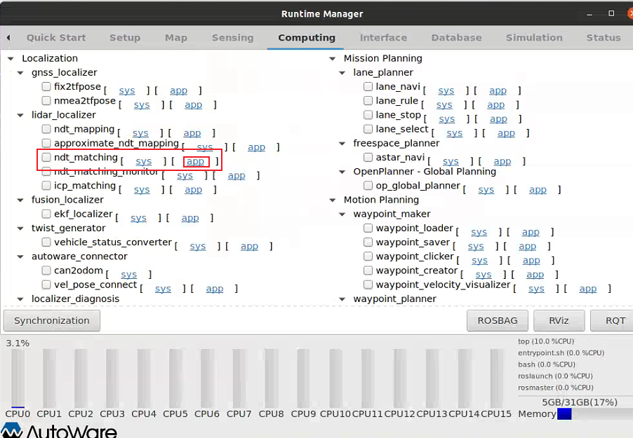
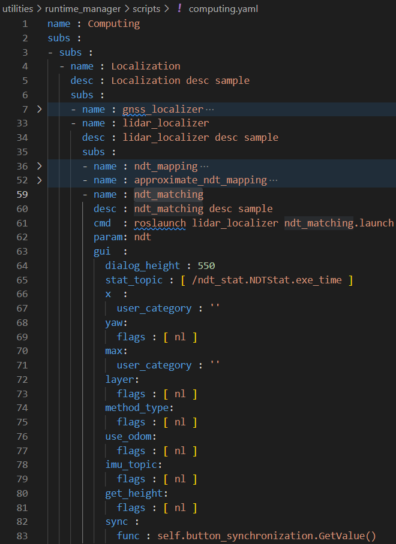
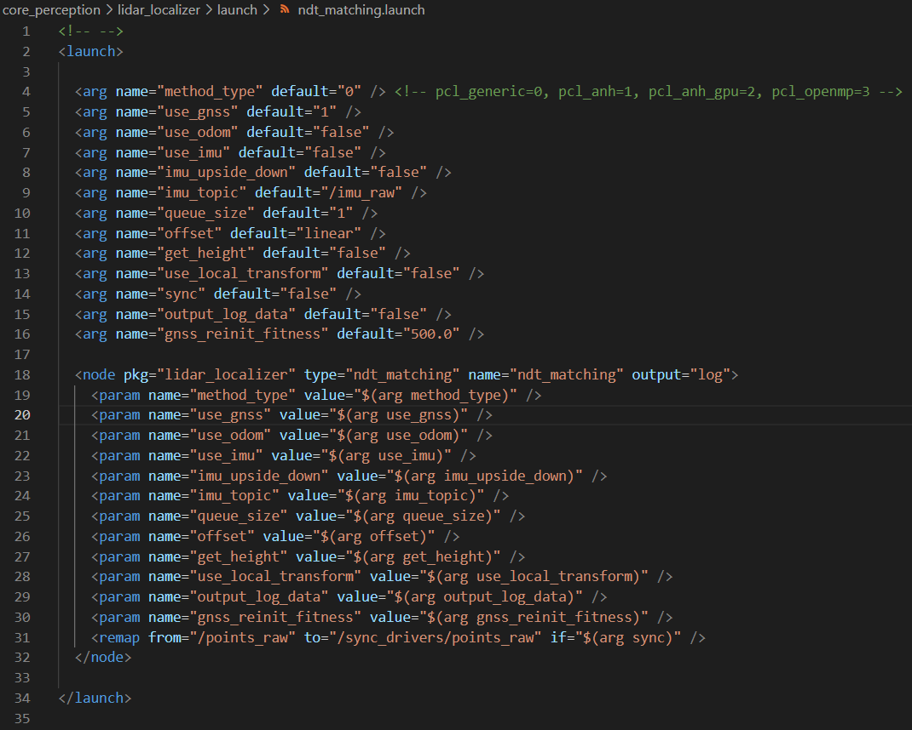
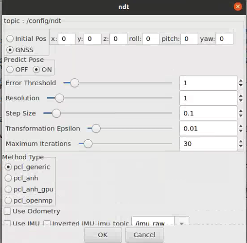
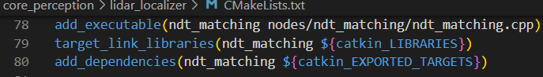

### Overview

- todo

## Lidar Localization

### ndt_matching

#### Functionality

- todo

#### Source code analysis

(1) If we tick `ndt_matching` in the `computing` page of autoware runtime manager (as shown below), the corresponding commands are:

```yaml
name : ndt_matching
desc : ndt_matching desc sample
cmd  : roslaunch lidar_localizer ndt_matching.launch
```



above commands are placed in `utilities\runtime_manager\scripts\computing.yaml`


(2) as we can see, the above commands use `roslaunch` to launch `ndt_matching.launch`, its location in the program is `core_perception\lidar_localizer\launch\ndt_mapping.launch`, and its main content is shown below:





as we can see, setting on the runtime manager is related to the value of parameters in the `ndt_mapping.launch`, while these parameters can be obtained by `ros::NodeHandle.getParam()` in the `ndt_matching` node.

(3) To identify the source code creating the `ndt_matching` node, we find the file `core_perception\lidar_localizer\CMakeLists.txt`. As shown below, `ndt_matching.cpp` is the source code of `ndt_matching` node, and its location is `core_perception\lidar_localizer\nodes\ndt_matching\ndt_matching.cpp`


(4) Now we are going to analyze [`ndt_matching.cpp`](ndt_matching.md)

(5) Besides we should notice the two relay nodes used to publish `"/current_pose"` and `"/current_velocity"`. Please refer to [`where_is_current_pose.md`](where_is_current_pose.md)

### ndt_mapping

- todo

### Difference btw ndt_matching&ndt_mapping

- todo

## GNSS localization

- todo

## EKF localization

- Time delay compensation


- smooth update

```cpp
void EKFLocalizer::measurementUpdatePose(const geometry_msgs::PoseStamped& pose)
{
    ...
    /* In order to avoid a large change at the time of updating, measurement update is performed by dividing at every
   * step. */
    R *= (ekf_rate_ / pose_rate_);
    ...
}
```

这里将R进行放大(ekf_rate_ / pose_rate_)倍，这意味着计算所得的Kalman Gain会减少对measurement的权重，因此该update受measurement的影响会减小，因此update的值不会突变。此外，在没有接受到新的measurement之前，该状态会持续update,而每次update时所用的measurement covariance 都是此处被放大的R。


