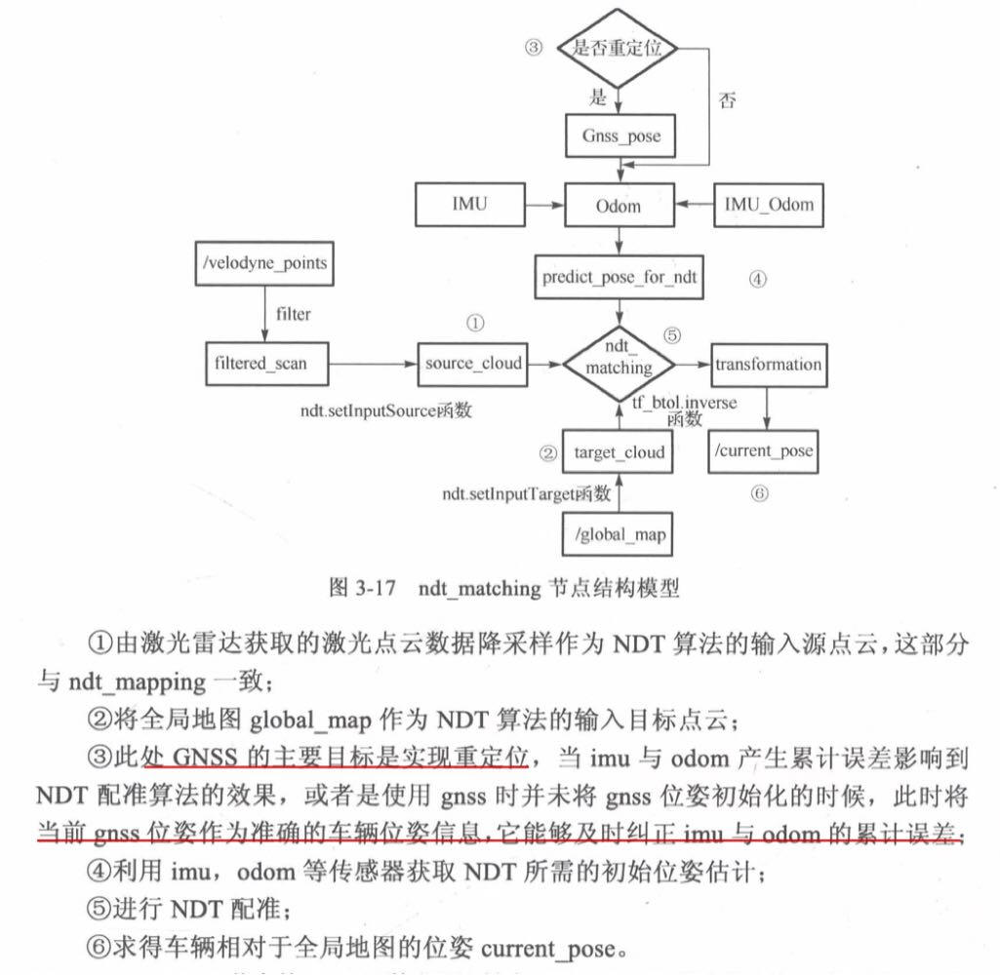
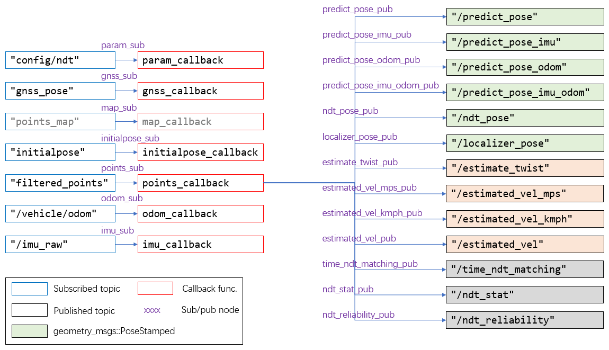
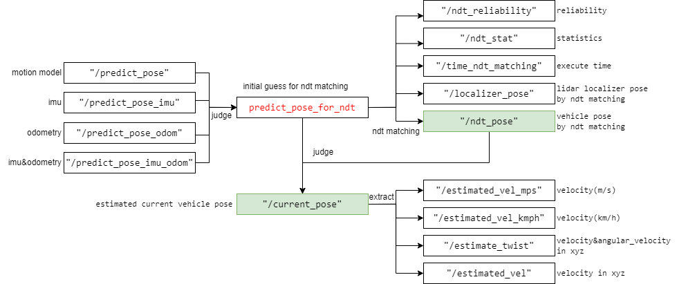
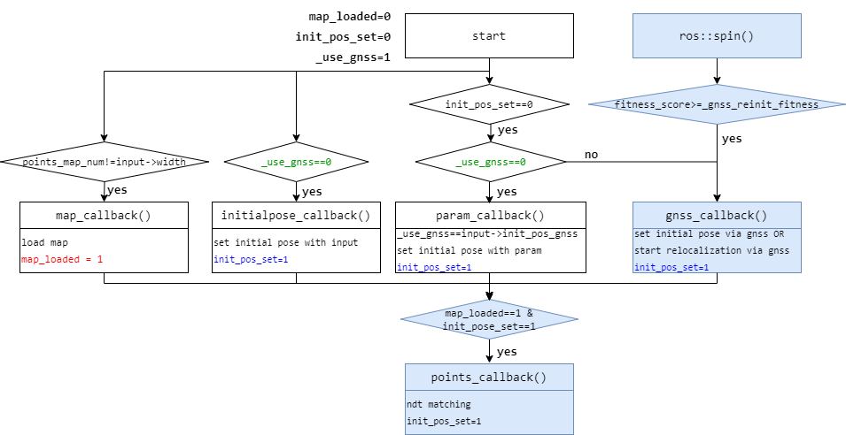
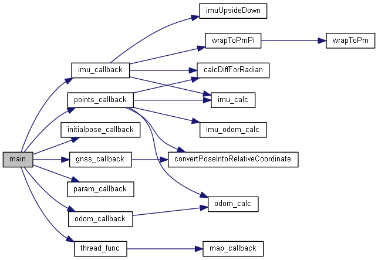
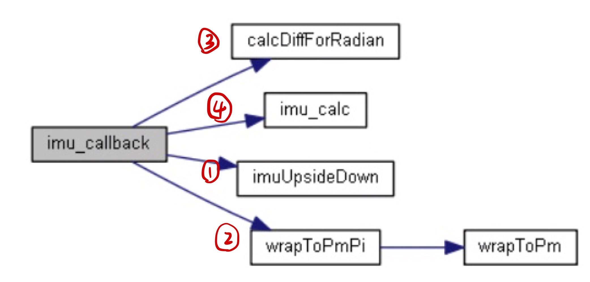
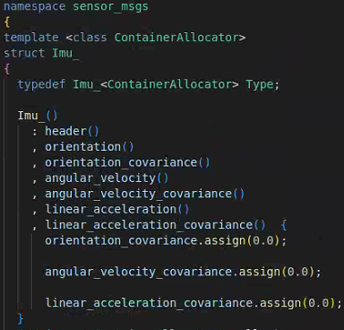
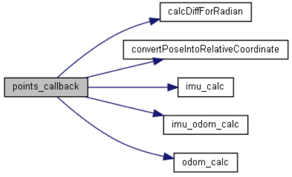

- [Overview](#overview)
  - [Functionality](#functionality)
  - [ROS node and topic](#ros-node-and-topic)
  - [Flag use in the program](#flag-use-in-the-program)
- [Function analysis](#function-analysis)
  - [main()](#main)
  - [param_callback()](#param_callback)
  - [gnss_callback()](#gnss_callback)
  - [thread_func()](#thread_func)
    - [map_callback()](#map_callback)
  - [initialpose_callback()](#initialpose_callback)
  - [odom_callback()](#odom_callback)
    - [odom_calc()](#odom_calc)
  - [imu_callback()](#imu_callback)
    - [<span id="jump_imu_calc">imu_calc()</span>](#imu_calc)
  - [points_callback()](#points_callback)
- [Remain problems](#remain-problems)
- [Reference](#reference)

## Overview

### Functionality



### ROS node and topic

(1)  Communication between nodes and related messages

In general, `ndt_matching` node creates 7 subscriber nodes and 13 publisher nodes, while all of these publisher nodes publish msgs in the `point_callback()` (the callback function when receiving `filtered_points`).  



(2) Relationships among messages (actually, all published in the `point_callback()`)

- `"/predict_pose"`is computed from motion model and `"/predict_pose_imu", "/predict_pose_odom", "/predict_pose_imu_odom"` are computed based on imu and/or odometry

- `predict_pose_for_ndt` is obtained by selecting pose information represented in above four msgs according to a certain certain, and is regarded as the initial guess for ndt matching

- After applying ndt matching, `"/ndt_pose"` and `"/localizer_pose"` are obtained as well as some statistic information

- `predict_pose_for_ndt` and pose information represented by `"/ndt_pose"` served as candidates for `"/current_pose"` , which is the final estimated current vehicle pose

- information like velocity and angle velocity are extracted from "/current_pose" to create `"/estimated_vel_mps"...`



### Flag use in the program

Two global static flags are used across multiple nodes:

```cpp
static int map_loaded = 0;
static int _use_gnss = 1;
static int init_pos_set = 0;
```

How these flags change are shown below:



However, there sames to be some **conflicts **when judging or setting the value of `init_pose_set` among `initialpose_callback(), param_callback()`  . I  **do not understand ** the mechanism when nodes are dealing with the same global variable.<span id="jump_q2">Q2</span>

## Function analysis

### main()

Overview:

```javadoc

```

The call graph of `main()` is given below:



The functionality of `main()` is given below:

- initialize `ndt_matching` node

- Set log file name

- Getting parameters via `ros::NodeHandle.getParam() `

- calculate the transformation matrix from base_link to lidar localizer `tf_btol` from parameters

- set `initial_pose` to 0

- setup 13 publishers and 7 subscribers

- setup thread (deal with received "points_map" topic)

The following global static variables are updated in `main()`:

```cpp
static Eigen::Matrix4f tf_btol;
static pose initial_pose;
```

### param_callback()

Overview:

```javadoc
/**
 * @brief callback function when receiving "config/ndt"。
 * setting and checking parameters 
 * set initial pose when _use_gnss == 0
 * @param input autoware_config_msgs::ConfigNDT::ConstPtr&
 */
```

The functionality of `param_callback()` is given below:

- judge and set `init_pos_set` according to `input->init_pos_gnss` and pose info in the input parameters

- `_use_gnss = input->init_pos_gnss`

- set `ndt_res, step_size, trans_eps, max_iter` with `input`

- when satisfying requirements (`_use_gnss == 0 and init_pos_set == 0` ):
  
  - set initial pose `initial_pose` with `input`
  
  - set `localizer_pose,previous_pose,current_pose` with `initial_pose`
  
  - reset `current_velocity, current_velocity_x/y/z,angular_velocity
    current_pose_imu,current_velocity_imu_x/y/z` to 0
  
  - set `init_pos_set` to 1

The following global static variables are updated in `param_callback()`:

```cpp
static int max_iter;
static float ndt_res;
static double step_size, trans_eps;
static pose initial_pose,localizer_pose,previous_pose,current_pose,current_pose_imu;
static double current_velocity, current_velocity_x,current_velocity_y, current_velocity_z,angular_velocity;
static double current_velocity_imu_x,current_velocity_imu_y,current_velocity_imu_z;
static int init_pos_set;
```

### gnss_callback()

Overview:

```javadoc
/**
 * @brief callback function when receiving "gnss_pose".
 * calculate current_pose solely by received gnss msgs and use it to replace the pose estimated by other sensors
 * @param input geometry_msgs::PoseStamped::ConstPtr&
 * @note re-localization happens in following two cases: \n
 * case 1: _use_gnss == 1 && init_pos_set == 0 \n
 * case 2: the quality of ndt-matching is too bad \n
 */
```

The functionality of `gnss_callback()` is given below:

- calculate`current_gnss_pose` from  `input`

- when satisfying requirements (`init_pos_set == 0` OR` fitness_score >= _gnss_reinit_fitness`): 
  
  - replace`previous_pose` with `previous_gnss_pose`
  
  - replace `current_pose` with`current_gnss_pose`
  
  - replace the pose estimated by other sensors solely by `current_gnss_pose`
  
  - calculate `current_velocity , current_velocity_x, current_velocity_y, current_velocity_z, angular_velocity`
  
  - reset `current_accel, current_accel_x, current_accel_y,current_accel_z` to zero
  
  - set `init_pos_set` to 1

- update `previous_gnss_pose` and `previous_gnss_time` 

The following global static variables are updated in `gnss_callback()`:

```cpp
static pose previous_pose,current_pose;
static double diff_x, diff_y, diff_z, diff_yaw, diff;
static double current_velocity_x, current_velocity_y, current_velocity_z, angular_velocity;
static double current_accel, current_accel_x, current_accel_y,current_accel_z;
static int init_pos_set;
```

### thread_func()

Overview:

```javadoc
/**
 * @brief load map vai thread.
 * use `ros::CallbackQueue` to subscribe "points_map" and call `map_callback()`
 * @param args 
 * @return void* 
 */
```

 <span id="jump_q4">Q4</span>

#### map_callback()

Overview:

```javadoc
/**
 * @brief callback function when receiving "points_map".
 * load LiDar data as initial global map and saved it to `map` \n
 * start the initial matching (dummy) and obtain initial `ndt`
 * @param input sensor_msgs::PointCloud2::ConstPtr&
 * @note this function is only valid when receiving the first frame of point cloud \n 
 * the matching process is dummy
 */
```

The functionality of `map_callback()` is given below:

- when satisfying requirements (`points_map_num != input->width`):
  
  - update `points_map_num` from `input`;
  
  - obtain the initial global map `map` (data type: pcl::PointCloudpcl::PointXYZ) from `input`;
  
  - broadcast `local_transform` (transformation between world & map coordinates) if needed;
  
  - start point cloud matching (dummy) with `map` as the target point cloud (and a dummy source point cloud), and then update `ndt`;
  
  - set `map_loaded` to 1 (stating that the initial matching is over).

The following global static variables are updated in `gnss_callback()`:

```cpp
static unsigned int points_map_num;
static pcl::PointCloud<pcl::PointXYZ> map;
static pcl::NormalDistributionsTransform<pcl::PointXYZ, pcl::PointXYZ> ndt;
```

### initialpose_callback()

Overview:

```javadoc
/**
 * @brief callback function when receiving "initialpose".
 * set the initial pose with input when _use_gnss==0
 * @param input geometry_msgs::PoseWithCovarianceStamped::ConstPtr&
 */
```

The functionality of `initialpose_callback()` is given below:

- set`current_pose` with`input`
- when satisfying requirements (`_get_height == true && map_loaded == 1`)
  - set `current_pose.z` with map data
- set `current_pose_imu, current_pose_odom, current_pose_imu_odom` with `current_pose`
- set `previous_pose` with `current_pose`
- reset `current_velocity, current_velocity_x/y/z, angular_velocity
  current_accel, current_accel_x/y/z, offset_x/y/z/yaw, offset_imu_x/y/z/roll/pitch/yaw,offset_odom_x/y/z/roll/pitch/yaw, offset_imu_odom_x/y/z/roll/pitch/yaw` to 0
- set `init_pos_set` to 1

The following global static variables are updated in `initialpose_callback()`:

```cpp
static double current_velocity, current_velocity_x,current_velocity_y,current_velocity_z, angular_velocity;
static double current_accel, current_accel_x,current_accel_y,current_accel_z;
static double offset_x,offset_y,offset_z,offset_yaw;
static double offset_imu_x,offset_imu_y,offset_imu_z,offset_imu_roll,offset_imu_pitch,offset_imu_yaw;
static double offset_odom_x,offset_odom_y,offset_odom_z,offset_odom_roll,offset_odom_pitch,offset_odom_yaw;
static double offset_imu_odom_x,offset_imu_odom_y,offset_imu_odom_z,offset_imu_odom_roll,offset_imu_odom_pitch,offset_imu_odom_yaw;
```

### odom_callback()

Overview:

```javadoc
/**
 * @brief callback function when receiving "/vehicle/odom"".
 * 
 * @param input av_msgs::Odometry::ConstPtr&
 */
```

The functionality of `odom_callback()` is given below:

- call odom_calc()

#### odom_calc()

Overview:

```javadoc
/**
 * @brief calculate the current pose via odometry info
 * 
 * @param current_time ros::Time
 * @note obtain the "predict_pose_odom"
 */
```

The following global static variables are updated in `odom_calc()`:

```cpp
static pose current_pose_odom,predict_pose_odom;
static double offset_odom_x,offset_odom_y,offset_odom_z,offset_odom_roll,offset_odom_pitch,offset_odom_yaw;
```

### imu_callback()

Overview:

```javadoc
/**
 * @brief callback function when receiving "/imu_raw".
 * 
 * @param input sensor_msgs::Imu::Ptr&
 */
```

The call graph of `imu_callback()` is given below:



The functionality of `imu_callback()` is given below:

- call ① to turn the imu upside down if needed;

- calculate `diff_time `between two frames; get `imu_roll, imu_pitch, imu_yaw` from `input`; 

- call ② to wrap `imu_roll, imu_pitch, imu_yaw` to $[-\pi,\pi] $;

- calculate `diff_imu_roll, diff_imu_pitch, diff_imu_yaw` via ③;

- fed `imu` (this is a global static variable, data type: `sensor_msgs::Imu`) with `input`;

- call  [④](#jump_imu_calc) to obtain `predict_pose_imu`(this is a global static variable, data type: `pose`);

- update `previous_time, previous_imu_roll, previous_imu_pitch, previous_imu_yaw`.

The following global static variables are updated in `imu_callback()`:

```cpp
static sensor_msgs::Imu imu;
```

The message structure of `sensor_msgs::Imu` is given below: 



#### <span id="jump_imu_calc">imu_calc()</span>

Overview:

```javadoc
/** 
 * @brief calculate the current pose via imu info
 * 
 * @param current_time ros::Time
 * @note obtain the "predict_pose_imu"
 */
```

The following global static variables are updated in `imu_calc()`:

```cpp
static pose current_pose_imu;
static double offset_imu_x, offset_imu_y, offset_imu_z;
static double current_velocity_imu_x, current_velocity_imu_y, current_velocity_imu_z;
static double offset_imu_roll, offset_imu_pitch, offset_imu_yaw;
static pose predict_pose_imu;
```

The definition of `pose` is given below:

```cpp
struct pose
{
  double x;
  double y;
  double z;
  double roll;
  double pitch;
  double yaw;
};
```

### points_callback()

Overview:

```javadoc
/**
 * @brief callback function when receiving "filtered_points".
 * multi-sensor fusion based localization (especially ndt matching)
 * @param input 
 * @note `current_pose` is published by `vel_pose_mux` \n 
 * `ndt_pose` and `current_pose` both refer to vehicle pose
 */
```

The call graph of `points_callback()` is given below:



The functionality of `points_callback()` is given below:

- when satisfying requirements (`map_loaded == 1 && init_pos_set == 1`):
  
  - load the current point cloud to `filtered_scan` from `input` ; set `filtered_scan` as the input source point cloud
  
  - guess the initial guess for ndt matching
    
    - calulate `diff_time` and `offset_x, offset_y, offset_z, offset_yaw` between current frame and last frame; 
    
    - calculate`predict_pose` based on motion model; 
    
    - calculate `predict_pose_imu_odom ,predict_pose_imu, predict_pose_odom` based on imu and/or odometry
    
    - obtain `predict_pose_for_ndt` by selecting among `predict_pose, predict_pose_imu_odom ,predict_pose_imu, predict_pose_odom`
    
    - obtain the initial guess `init_guess`(a transformation matrix) for ndt from `predict_pose_for_ndt`
  
  - start ndt matching and obtain
    
    - `t` : the final transformation matrix from world to localizer
    
    - `t2` : the final transformation matrix from world to base_link
  
  - obtain ndt results
    
    - update `localizer_pose` (lidar localizer pose in the world coordinate) based on `t`
    
    - update `ndt_pose` (vehicle pose in the world coordinate) based on `t2`
    
    - obtain `current_pose` (current vehicle pose in the world coordinate) by selecting among  `ndt_pose` and `predict_pose_for_ndt`
    
    - calculate `current_velocity, angular_velocity, current_accel, current_accel_x/y/z` based on `current_pose`
    
    - reset `current_pose_imu, current_velocity_imu_x/y/z, current_pose_odom, current_pose_imu_odom` with `current_pose`
  
  - publish msgs:
    
    - estimated_vel_mps_pub.publish(estimated_vel_mps)
    
    - estimated_vel_kmph_pub.publish(estimated_vel_kmph)
    
    - predict_pose_imu_pub.publish(predict_pose_imu_msg)
    
    - predict_pose_odom_pub.publish(predict_pose_odom_msg)
    
    - predict_pose_imu_odom_pub.publish(predict_pose_imu_odom_msg)
    
    - predict_pose_pub.publish(predict_pose_msg)
    
    - ndt_pose_pub.publish(ndt_pose_msg)
    
    - localizer_pose_pub.publish(localizer_pose_msg)
    
    - time_ndt_matching_pub.publish(time_ndt_matching)
    
    - estimate_twist_pub.publish(estimate_twist_msg)
    
    - estimated_vel_pub.publish(estimate_vel_msg)
    
    - ndt_stat_pub.publish(ndt_stat_msg)
    
    - ndt_reliability_pub.publish(ndt_reliability)
  
  - update `previous_pose, previous_scan_time, previous_previous_velocity, previous_velocity, previous_velocity_x/y/z, previous_accel, previous_estimated_vel_kmph`

**Note:**

- `current_pose` is published by `vel_pose_mux` **(I do not know where `vel_pose_mux` is)**  <span id="jump_q4">Q4</span>
  
  The following global static variables are updated in `points_callback()`:

```cpp
static pose predict_pose, predict_pose_imu_odom, predict_pose_imu, predict_pose_odom, localizer_pose,ndt_pose, current_pose;
static double current_velocity, angular_velocity, current_velocity_smooth;
static double current_velocity_imu_x, current_velocity_imu_y, current_velocity_imu_z;
static pose current_pose_imu, current_pose_odom, current_pose_imu_odom;
static double current_accel, current_accel_x, current_accel_y, current_accel_z;
static std_msgs::Float32 estimated_vel_mps, estimated_vel_kmph;
static geometry_msgs::PoseStamped predict_pose_msg, predict_pose_imu_msg, predict_pose_odom_msg, predict_pose_imu_odom_msgpredict_pose_imu_odom_msg, localizer_pose_msg;
static double exe_time;
static std_msgs::Float32 time_ndt_matching,ndt_reliability;
static geometry_msgs::TwistStamped estimate_twist_msg;
static autoware_msgs::NDTStat ndt_stat_msg;
```

## Remain problems

- what's functionality and aim of `tf::TransformBroadcaster` 
- the mechanism when nodes are dealing with the same global variable. [Q2](#jump_q2)
- thread function and `ros::CallbackQueue`. [Q3](#jump_q3)
- `current_pose`is published by`vel_pose_mux`. [Q4](#jump_q4)

## Reference

1. [to know more about pcl::NormalDistributionsTransform](https://docs.ros.org/en/hydro/api/pcl/html/classpcl_1_1NormalDistributionsTransform.html)

2. [analysis of ndt_matching.cpp by Zhang](https://blog.csdn.net/qq_37946291/article/details/103892680)
