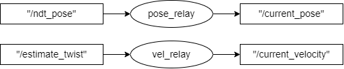
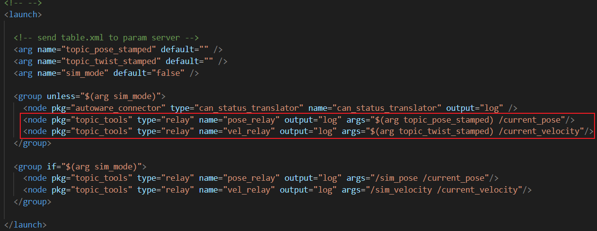
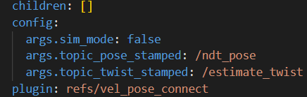
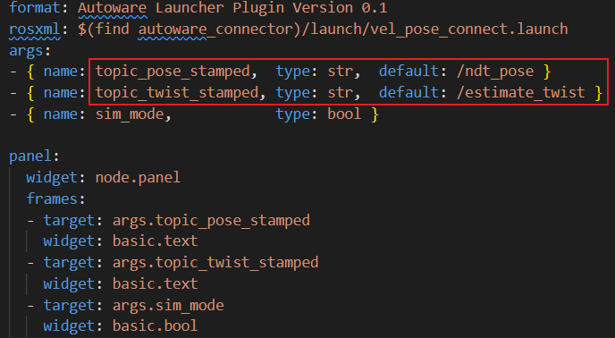
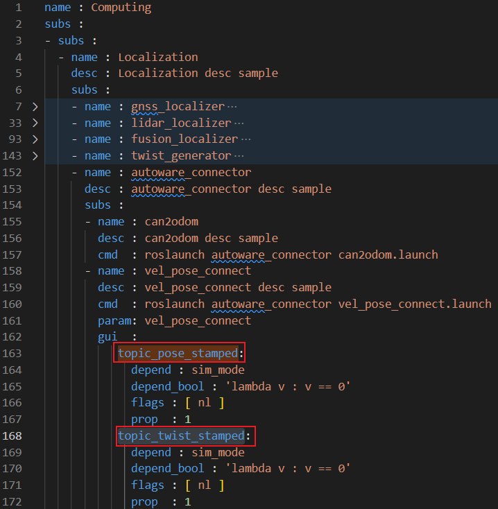
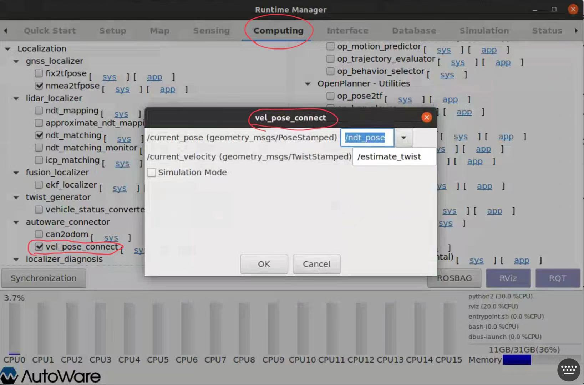

### Takeaways

- `pose_relay` node relay the msgs `"/ndt_pose"` to `"/current_pose"`
- `vel_relay` node relay the msgs `"/estimatd_twist"` to `"/current_velocity"`

### main content

As shown in the following picture ( `core_perception\autoware_connector\launch\vel_pose_connect.launch`)，`vel_pose_connect.launch` launch the `relay` node in the `topic_tools` package, whereas [`relay`](http://wiki.ros.org/topic_tools/relay) is ROS node that subscribes to a topic and republishes all incoming data to another topic. 



The usage of `relay` is given below:

```
relay <intopic> [outtopic]

Note:
- intopic: Incoming topic to subscribe to
- outtopic: Outgoing topic to publish on (default: intopic_relay)
```

It's clear that `"/current_pose"`  is the output topic of `pose_relay` node, and the input topic is `$(arg topic_pose_stamped)`. But where is `$(arg topic_pose_stamped)` defined?

Well, here are screenshots of some `.yaml` files in the autoware project.

- path:utilities\autoware_launcher\profiles\quickstart\root\localization\vel_pose_connect.yaml
  

- path:utilities\autoware_launcher\plugins\refs\vel_pose_connect.yaml
  

- path: utilities\runtime_manager\scripts\computing.yaml
  

The corresponding page of `runtime_manager` is given below:



As shown, `topic_pose_stamped` is set to `"/ndt_pose"` in default according to those `.yaml` files, and if you tick the `vel_pose_connect` in the page `computing` in `runtime_manager`, the  two `relay` nodes (i.e., `pose_relay`, `vel_relay`) will be launched, and the message flow can be described below:


